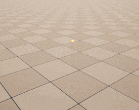
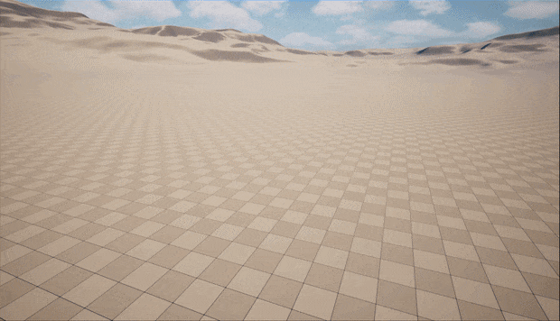
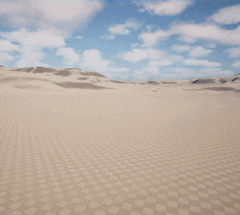
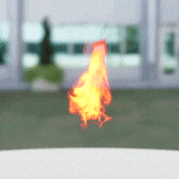
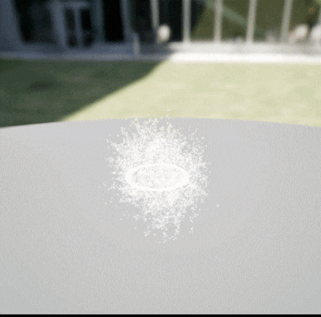
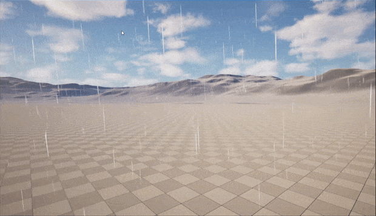
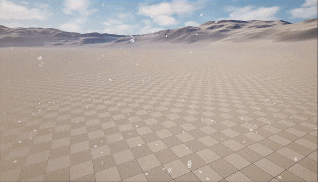
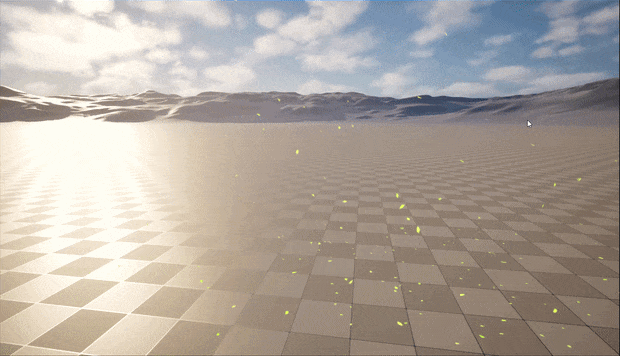

# 🌌 Unreal Engine VFX Portfolio

This repository showcases my real-time visual effects developed in **Unreal Engine**. Each project follows a professional workflow: creating custom textures in **GIMP**, generating optimized flipbooks via **FluidNinja**, and final assembly within the **Niagara** system.

## 🛠️ Tools Used
* **VFX Production:** Unreal Engine 5.x (Niagara)
* **Fluid Dynamics:** FluidNinja (Flipbook Generation)
* **Texturing:** GIMP (Custom Alpha & Sprite Sheets)

---

## 💥 Explosions & Combat
> High-intensity explosive effects and projectile impacts. Developed with a focus on realistic velocity, radial forces, and optimized GPU particle emission.

| Firebottle | Bomb | Scatter |
| :---: | :---: | :---: |
|  |  |  |

---

## 💨 Elemental Simulations
> High-fidelity simulations including fluid and thermal dynamics. Utilizing baked fluid data to achieve cinematic motion with minimal performance overhead.

| Flame | Smoke | Ripple |
| :---: | :---: | :---: |
|  |  |  |

---

## 🍃 Atmospheric Environments
> Immersive environmental systems designed with dynamic vector fields to ensure realistic interaction with the game world.

| Rain | Snow | Leaf |
| :---: | :---: | :---: |
|  |  |  |
